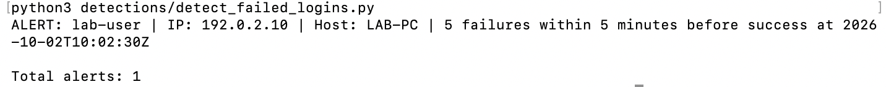

# soc-detection-investigation-lab
# SOC Detection Engineering and Incident Investigation Lab

## Project Status
## Project Status

The first detection is implemented in Python using synthetic login events.

### Completed
- Created an eight-event synthetic login dataset.
- Built a detection for five or more failed logins within five minutes followed by a successful login.
- Grouped events by username, source IP, and host.
- Generated one alert from the sample dataset.
- Passed seven checks covering the threshold, time boundary, and event grouping.

### Project Evidence
- [Python detection](detections/detect_failed_logins.py)
- [Detection rule and limitations](detections/failed-login-rule.md)
- [Synthetic dataset](sample-logs/synthetic-login-events.csv)
- [Detection output](reports/failed-login-output.txt)
- [Seven validation results](reports/failed-login-validation.txt)

### Next Steps
- Write an investigation report for the sample alert.
- Add more detection scenarios.
- Explore real event logs and SIEM integration.

This phase uses fictional data for learning. Real Windows log collection
and SIEM integration have not been implemented.

## Overview
This is a personal cybersecurity lab for practicing security
monitoring, threat detection, alert investigation, and incident
reporting using controlled test activity.

## Objective
Collect Windows security events in a SIEM, create three detection
rules, validate their behavior, and document one investigation.

## Planned Detection Scenarios

### 1. Repeated Failed Logins Followed by Success
Identify multiple failed login attempts followed by a successful
login involving the same account.

Investigate whether the activity reflects normal user mistakes
or potentially suspicious access.

### 2. Privileged Group Membership Change
Identify when an account is added to a privileged local group.

Investigate who made the change, which account was added, and
whether the change was expected.

### 3. Suspicious PowerShell Activity
Identify a selected suspicious PowerShell command pattern.

Use harmless lab commands to test the rule and examine the
process context before deciding whether an alert is concerning.

## Planned Tools
- Windows lab machine
- Windows Security event logs
- Sysmon for additional system activity
- One SIEM: Splunk or Microsoft Sentinel, to be selected
- Python for a small alert-summary utility
- GitHub for documentation and version history

## Planned Deliverables
- Lab setup guide
- Architecture diagram
- Three detection queries
- Detection validation results
- One incident investigation report
- A small Python alert-summary script
- Dashboard screenshots
- Short demonstration video

## Scope
All testing will use systems I own or am authorized to test.
Published evidence will contain only sanitized lab data.
Simulated activity will be clearly labeled.

## Success Criteria
- Required logs are searchable in the SIEM.
- Each rule detects its intended lab test.
- Each rule is also tested against legitimate activity.
- False positives and limitations are documented.
- Another person can understand and reproduce the setup.

## Progress
- [x] Defined the project objective
- [x] Selected three detection scenarios
- [x] Created the project repository
- [ ] Prepared the lab environment
- [ ] Configured log collection
- [ ] Built and validated detection rules
- [ ] Completed an investigation report
- [ ] Added Python automation
- [ ] Published the portfolio case study
## Detection Screenshot

Python detection output from the synthetic login dataset:

## Investigation Report

[Read the synthetic login alert investigation](reports/failed-login-investigation.md)
